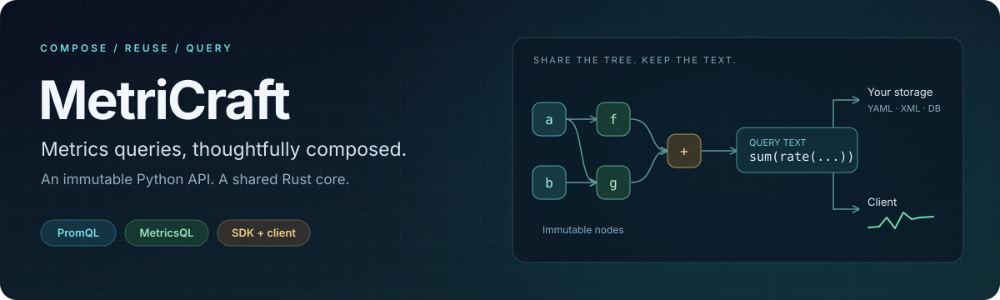

<p align="center">
  
</p>

<p align="center">
  <a href="https://github.com/NagareWorks/metricraft/actions/workflows/ci.yml"></a>
  
  
  <a href="LICENSE"></a>
</p>

<p align="center">
  <b>Compose queries. Reuse expressions. Query your metrics.</b><br>
  An immutable Python SDK for PromQL and MetricsQL, with a shared Rust core<br>
  and a synchronous / asynchronous Prometheus and VictoriaMetrics client.
</p>

<p align="center">
  <a href="#start-here">Get started</a> ·
  <a href="docs/examples/01_configurable_query/README.md">Examples</a> ·
  <a href="docs/language-support.md">Language support</a> ·
  <a href="CONTRIBUTING.md">Contribute</a>
</p>

## Build once, use anywhere

```python
from metricraft import QueryBuilder as Q

requests = Q.from_metric("http_requests_total").where_eq("job", "api")
all_requests = requests.rate("5m").sum()
failed_requests = requests.where_regex("status", "5..").rate("5m").sum()

text = (failed_requests / all_requests).build("promql")
```

Every operation returns a new expression. Branches share immutable Rust nodes,
so refining `failed_requests` leaves `requests` available for reuse.

| Step | Who handles it |
| --- | --- |
| Compose filters, functions and grouping from structured inputs | MetriCraft validates and escapes values while building. |
| Save the resulting query text in YAML, XML or a database | Your application chooses its storage and format. |
| Load the text and execute it later | The client sends it to Prometheus or VictoriaMetrics. |

```python
from metricraft import DatabaseClient, PrometheusConfig

with DatabaseClient(PrometheusConfig("http://localhost:9090")) as client:
    result = client.query(text)
```

The builder's safety boundary is structured construction. The client executes
supplied query text; applications own authorization and validation of stored text.
Client-only use requires no native library.

## Start here

Install from source with Python 3.8+ and a Rust toolchain:

```sh
git clone https://github.com/NagareWorks/metricraft.git
cd metricraft
python -m pip install -e "python/metricraft[dev]"
python scripts/dev.py build
python scripts/dev.py smoke
```

Native wheels are assembled and tested by GitHub Actions for Linux x86_64,
Windows x86_64, macOS Intel and Apple Silicon. Release publication uses those
same validated artifacts.

## One builder, two dialects

- **PromQL and MetricsQL:** select the dialect at build time; unsupported forms
  are rejected, including inside nested expressions.
- **Pure composition:** immutable trees share subexpressions across branches;
  the Rust core owns validation, rendering and native memory lifetime.
- **Structured extensions:** vector matching, chained `.by()` / `.without()`,
  subqueries and MetricsQL `WITH` templates stay within the same API.
- **Independent client:** sync and async queries support Prometheus,
  VictoriaMetrics single-node and cluster configurations in one package.

The stable language baseline is **Prometheus 3.15.0 / VictoriaMetrics 1.153.0**.
[Language support](docs/language-support.md) explains feature flags and limits.
Actions generates upstream compatibility reports and validates real backend
results; benchmark and sanitizer reports are separate artifacts.

## Explore

- [Build queries from UI selections](docs/examples/01_configurable_query/README.md)
- [Save query text and execute it later](docs/examples/02_saved_query/README.md)
- [Use language extensions and scoped templates](docs/examples/03_language_extensions/README.md)
- [Architecture and responsibility boundaries](docs/architecture.md)
- [Benchmarks and memory behavior](benchmarks/README.md)
- [Comparison with Grafana's query builder](docs/api-comparison.md)

Documentation is maintained in English.
[Apache 2.0](LICENSE) · [Contributing](CONTRIBUTING.md) ·
[Contributors](https://github.com/NagareWorks/metricraft/graphs/contributors)
